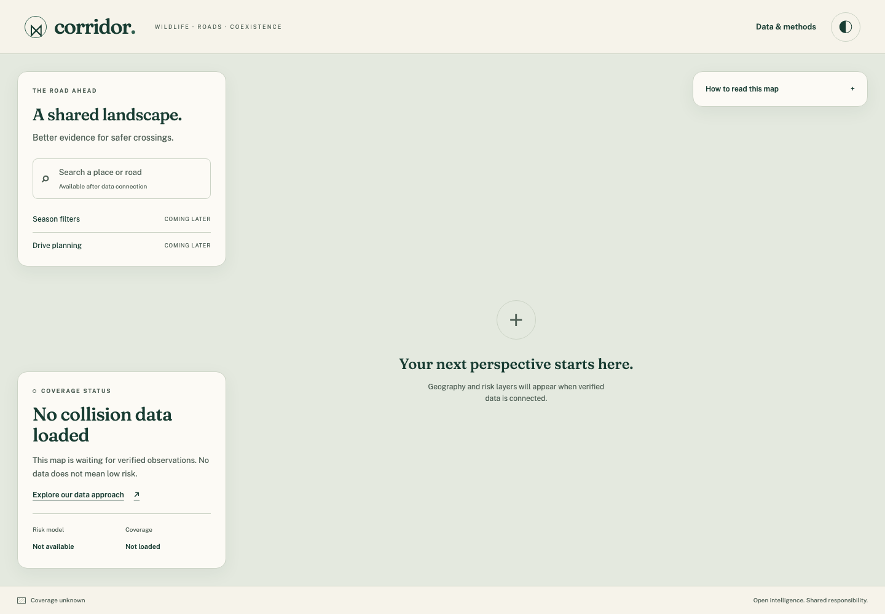

# Corridor

Open wildlife–vehicle collision intelligence for safer roads and connected habitats.

The foundation runs one Go application with an embedded SvelteKit interface,
PostgreSQL/PostGIS/H3 and private S3-compatible storage. It clearly separates
empty coverage from unavailable data. Ingestion, risk modeling, prioritization,
field reporting and routing remain future phases. No collision observations or
invented risk scores are bundled.



## Run locally

Prerequisites: Docker with Compose and Go 1.27.1 (Go's toolchain resolver can
install it). The first build downloads images and compiles dependencies.
After those downloads, initialization and startup target under 60 seconds.

```sh
go run ./cmd/corridorctl init-dev
docker compose up --build --wait
```

Open http://localhost:8080. `init-dev` creates a private, ignored `.env` with
random credentials and refuses to replace an existing file. Keep it with your
persistent volumes. Only the application port is published, on loopback.

```sh
curl --fail http://localhost:8080/readyz
curl --fail http://localhost:8080/v1/coverage
docker compose down  # retains your database and object volumes
```

The HTTP process has no migration or storage administrator credentials. The
application image contains only Go executables and embedded assets, runs as a
non-root user, and has a read-only filesystem. Node is a build dependency only.

## Current scope

- OpenAPI 3.1 health, readiness, publication-safe coverage and source endpoints.
- Provenance schema, immutable artifacts, spatial constraints, least-privilege
  public projections, and a sensitive-record publication delay.
- Responsive light/dark map shell, methods page, keyboard controls and WebGL
  fallback. The geography-free canvas is intentional: no licensed basemap or
  ingested collision dataset is bundled. Blank space does not mean low risk.
- Real PostGIS/S3 integration and browser checks. See the exact evidence and
  limitations in [verification](docs/verification/phase-1.md).

MinIO upstream is archived. The pinned source build is an isolated development
companion, not a recommendation for a maintained production deployment. Choose
a maintained S3 service before production hosting; see [ADR 0004](docs/decisions/0004-storage-lifecycle.md).

## Development and evidence

- [Contributing and verification commands](CONTRIBUTING.md)
- [Progress and remaining phases](docs/PROGRESS.md)
- [Original brief](docs/BRIEF.md)
- [Research](docs/RESEARCH.md) and [source rights ledger](data/SOURCES.md)
- [Dependency versions and licenses](docs/DEPENDENCIES.md)

Original code is Apache-2.0. Data and dependencies retain their own licenses.
Raw research files remain private and ignored. Acquisition URLs stay private;
public source attribution requires a separately reviewed `sources.public_url`
landing page with no credentials, query or fragment. Never copy signed download
URLs into that field. Existing sources are not automatically backfilled. No hosted demo or trained model
is claimed.

## Troubleshooting

- Missing variable: run `init-dev` once from this repository; never paste a
  shared example password. Existing `.env` files are intentionally preserved.
- Port 8080 occupied: stop the conflicting local service or change only the
  loopback host port in Compose. Keep the container probe on port 8080.
- Readiness returns 503: inspect `docker compose ps` and dependency logs. A
  working empty database returns `state: empty`; an outage must not do so.
- H3 migration failure: rebuild the pinned database image. A plain PostgreSQL
  image is insufficient. No partial application schema should be committed.
- Changed credentials with existing volumes: do not delete volumes to fix it.
  Restore the original environment or deliberately rotate credentials with
  administrator access and verified backups.
