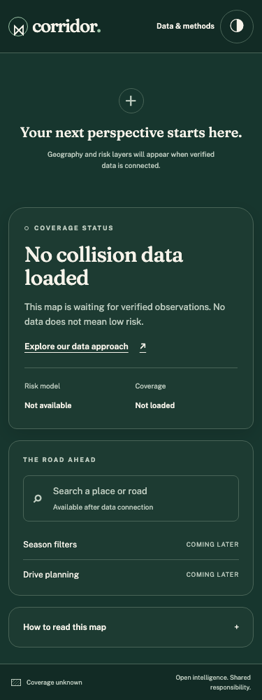

# Phase 1 verification

Executed locally on 2026-09-21, macOS ARM64, Docker 28.3.3. Go 1.27.1;
Node 24.21.0 in the image (host Node 25.9.0); Svelte 5.57.1, SvelteKit 2.70.3,
Playwright 1.63.0, Vitest 4.1.11. Branch: `feat/foundation`.

## Commands and outcomes

| Check | Evidence |
| --- | --- |
| `make verify` | Passing generation checks, frontend types/lint/unit coverage/build, Go formatting/goimports/vet/race, per-package coverage, gosec, govulncheck, npm audit |
| `make images` / image builds | PostgreSQL 16/PostGIS 3.6.4/H3 4.2.3 and checksum-pinned MinIO source build; local ARM64 |
| Tagged DB integration | Transactional migration, repeat application, actual missing-H3 failure after PostGIS availability, private-table permission denial, delayed sensitive count, immutable artifacts, source-matching artifact references; credential-bearing acquisition URLs withheld until a separate safe public URL is reviewed |
| Tagged storage integration | Private bucket, repeat setup, application write denial, anonymous object read denial |
| `docker compose -p corridor-foundation-acceptance up --build --wait` | Healthy application after migration and setup; real empty database and private storage |
| `go test -tags=acceptance ./tests/acceptance -count=1` | All three acceptance tests pass; actual executable health probe and root/data/coverage; DB shutdown gives 503 for readiness/coverage/sources while liveness remains 200; restart retains volumes; isolated paused initialization stays unready until TCP is available and migrations then succeed |
| Embedded runtime | No `/src` or Node executable in application container; attempted root-filesystem write rejected; only loopback port 8080 exposed |
| Missing environment | `--env-file /dev/null config --quiet` fails before startup |
| Warm start | `docker compose ... up -d --wait`: 2.47 seconds with existing images/volumes. First builds/downloads are excluded |
| Browser suite against Go | 60/60 passing across Chromium, Firefox and WebKit |
| Failure-gate probes | Controlled generated-contract drift and a TypeScript assignment error both rejected; original files restored |

Browser coverage includes 320/375/768/1024/1440/1920 widths, both themes,
root and methods axe scans, persisted keyboard theme selection, disclosure
keyboard/focus behavior, 200% zoom, storage denial, WebGL failure and reduced
motion. Screenshots were inspected for desktop/light and mobile/dark. Native
screen-reader speech/navigation was not manually exercised: automated semantic
checks do not prove complete WCAG conformance.

## Coverage

Generated API and sqlc adapters are excluded from authored-code coverage and
remain tested through contract and database integration. `scripts/coverage.awk`
requires every authored internal Go package to reach 80% statements.

| Package | Statement coverage |
| --- | ---: |
| API | 95.0% |
| CLI | 83.6% |
| Configuration | 100.0% |
| Database | 82.9% |
| HTTP lifecycle | 80.0% |
| Storage | 81.0% |
| Static web | 96.4% |

Frontend helper logic: 100% statements, branches, functions and lines across
15 unit/component tests. Svelte rendering/lifecycle behavior is additionally
covered by the browser suite; this is not a claim of instrumenting generated
Svelte compiler output.

## Security scan scope

Gosec: zero findings, with one narrow G304 suppression for exclusive creation
of the constant local `.env` path (test-only callers use temporary paths).
Govulncheck: zero reachable vulnerabilities; three advisories in required
modules are not on called paths. npm audit: zero advisories after a compatible
cookie override, current Lighthouse selection, and a patched Prometheus
transitive dependency for madmin. The archived MinIO companion remains a
separate operational limitation; this scan is not a claim that its entire
source/deployment is production-ready.

## Performance

The checked-in `phase-1-performance.json` records the actual deployed assets,
three Lighthouse runs, and the map load mark. Method: mobile 375×812, simulated
4G (150 ms RTT / 1638.4 Kbps), CPU 4× for Lighthouse. Map timing separately
uses applied 4G network throttling and the real MapLibre load event. Lighthouse
runs use a fresh browser profile; no synthetic observations or risk geometry.

Precompressed Brotli/gzip static files avoid repeated runtime compression.
Zod Mini reduces validation bytes; the map module is preloaded on `/` but
instantiated only in the browser. Its bytes are included in the initial budget,
not hidden as deferred transfer. The two-second result has little headroom and
must be remeasured as layers/features are added. No 100k-point or populated-map
performance claim is made.

## Limits and remaining work

- Remote CI is configured with pinned actions and read-only repository
  permissions but has not run: no Git remote exists. AMD64 is an explicit CI
  target, not a locally verified architecture.
- No licensed collision dataset, basemap, trained model, auth/reporting flow,
  analysis, tile service or route scoring is implemented in this phase.
- Privacy foundation hides precise tables and delays sensitive public counts;
  public H3-generalized spatial products belong to ingestion/release phases.
- MinIO is an archived, private development companion. Production hosting
  requires a maintained S3 service and deployment/security decisions.

## Independent review and fix verification

A fresh-context reviewer inspected `bc7af3f..1e06b83` and requested changes for
two Important findings. No Critical or Minor findings were reported. One fix
pass addressed both in `64f7de1`, with regressions observed failing first:

1. **Acquisition URL credentials:** `TestAcquisitionCredentialsStayPrivate`
   reproduced userinfo passwords and signed queries in the public source
   projection. Migration 00003 adds a separate `public_url`; only approved
   sources with a reviewed public URL and an artifact appear in the public
   source list. It rejects userinfo, queries, fragments, whitespace and
   backslashes. Acquisition URLs remain private and unchanged. No backfill is
   inferred. Operators must also inspect landing-page paths for secrets.
2. **Fresh-start readiness race:** `TestFreshPostgresWaitsForTCP` paused the
   actual initialization server and reproduced its premature healthy status.
   The Compose probe now targets TCP `127.0.0.1`. The test confirms unready
   status during initialization and successful migrations after release, then
   removes only its isolated project and volumes.

The author verified both fixes and reran the full suite; a second independent
review was not commissioned. Existing acceptance volumes upgraded to migration
3 without replacement. The reviewer did not independently execute remote CI,
AMD64, manual screen-reader checks, future products or destructive outage
acceptance; the scope decisions and all implementation rulings are preserved
in [the execution record](phase-1-execution.md). No deferred minor findings.

